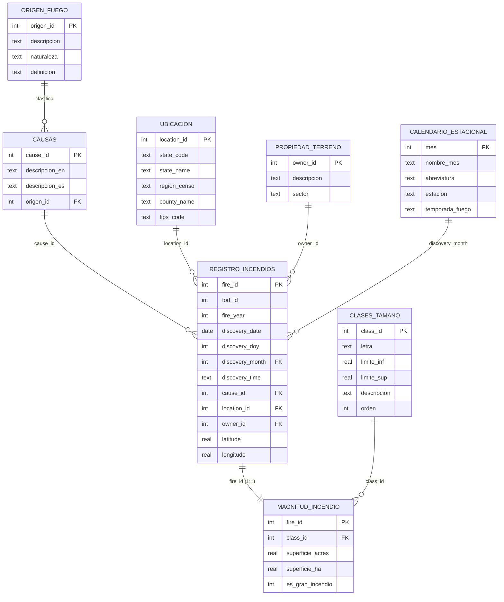

# Modelado de datos

Documentación del diseño de la base de datos de la investigación **"Origen del fuego:
incendios antrópicos vs. naturales en Estados Unidos, 1992-2015"**.

---

## 1. Punto de partida: la fuente cruda

La base descargada de Kaggle (`FPA_FOD_20170508.sqlite`, 795 MB) contiene una tabla
principal, `Fires`, con **39 columnas y 1.880.465 filas**, además de una tabla de
catálogo (`NWCG_UnitIDActive_20170109`) y una veintena de tablas internas de SpatiaLite
que no forman parte del dato analítico.

La tabla `Fires` está **completamente desnormalizada**. Sus problemas estructurales son
tres:

| Problema | Manifestación concreta en la fuente |
|---|---|
| **Redundancia** | La cadena `Debris Burning` se almacena 429.028 veces; `MISSING/NOT SPECIFIED` aparece 1.050.835 veces. |
| **Dependencias transitivas** | La clase de tamaño (`FIRE_SIZE_CLASS`) depende funcionalmente de la superficie (`FIRE_SIZE`), no del incendio. |
| **Mezcla de dominios** | Conviven en una misma fila identificadores de trazabilidad, atributos temporales, geográficos, de magnitud y organizativos. |

Adicionalmente, la fuente **no contiene la variable central de esta investigación**: no
existe ningún campo que clasifique el origen del fuego. Esa variable se construye en el
proceso ETL a partir de la causa estadística.

---

## 2. Modelo lógico: esquema en estrella en 3FN

El modelo resultante es un **esquema en estrella** (Kimball) normalizado hasta la
**Tercera Forma Normal** (Codd): dos tablas de hechos en relación 1:1 rodeadas de seis
dimensiones.



### 2.1. Inventario de tablas

| Tabla | Tipo | Filas | Función en el modelo |
|---|---|---:|---|
| `registro_incendios` | Hechos | 1.880.465 | Cuándo, dónde y por qué ocurrió cada incendio |
| `magnitud_incendio` | Hechos | 1.880.465 | Cuánta superficie quemó cada incendio |
| `ubicacion` | Dimensión | 2.847 | Estado, región censal y condado |
| `propiedad_terreno` | Dimensión | 16 | Propietario del terreno y sector agregado |
| `causas` | Dimensión | 13 | Causas estadísticas del estándar NWCG |
| `calendario_estacional` | Dimensión | 12 | Mes, estación y temporada de fuego |
| `clases_tamano` | Dimensión | 7 | Clases de tamaño NWCG (A–G) |
| `origen_fuego` | Dimensión | 3 | **Variable segmentadora de la investigación** |

---

## 3. Decisiones de diseño y su justificación

### 3.1. ¿Por qué dos tablas de hechos en lugar de una?

`registro_incendios` y `magnitud_incendio` comparten llave primaria (`fire_id`) y por
tanto mantienen una relación estricta **1:1**. Podrían ser una sola tabla. Se separaron
por dos razones:

1. **Coherencia semántica.** Responden a preguntas distintas: la primera describe la
   *ocurrencia* del evento; la segunda, su *consecuencia física*.
2. **Rendimiento en formato columnar.** En Parquet, cada tabla es un archivo
   independiente. Una consulta que solo agrupa por mes y cuenta eventos lee
   exclusivamente `registro_incendios.parquet` (35 MB) e ignora por completo el archivo
   de magnitud. La separación reduce el volumen leído por consulta.

### 3.2. La dependencia transitiva causa → origen

Este es el caso de 3FN más relevante del modelo. El origen del fuego **no depende del
incendio**: depende de su causa. Todo incendio cuya causa sea `Lightning` es, por
definición, de origen natural.

Si el campo `origen` viviera en la tabla de hechos, existiría una dependencia
transitiva `fire_id → cause_id → origen`, prohibida por la Tercera Forma Normal, con
dos consecuencias prácticas:

- Se almacenaría la cadena `Antropico` 1.111.469 veces.
- Reclasificar una causa exigiría actualizar cientos de miles de filas de hechos.

La solución adoptada ubica `origen_id` como llave foránea **en la dimensión `causas`**.
Reclasificar una causa es hoy una única sentencia `UPDATE` sobre 1 fila.

### 3.3. Llave subrogada frente a llave natural

La fuente ya trae un identificador único (`FOD_ID`). Aun así se introdujo `fire_id`,
una llave subrogada correlativa asignada por el ETL. El motivo es de independencia: la
llave del modelo no queda atada a las decisiones de numeración de la fuente, que podría
cambiar entre ediciones de la base. `fod_id` se conserva como atributo, de modo que
**cualquier fila del modelo es trazable hasta el registro original de Kaggle**.

### 3.4. Campos derivados materializados

Tres campos no existen en la fuente y se calculan una sola vez en el ETL:

| Campo | Cálculo | Justificación |
|---|---|---|
| `superficie_ha` | `superficie_acres × 0,40468564224` | Permite contrastar con literatura internacional sin convertir en cada consulta. |
| `es_gran_incendio` | `1` si la clase es F o G | Filtro de uso muy frecuente; como bandera entera es más rápido que comparar cadenas. |
| `discovery_month` | Extraído de la fecha de detección | Llave foránea hacia el calendario estacional. Evita ejecutar una función de fecha sobre 1,88 millones de filas en cada consulta. |

### 3.5. Atributos jerárquicos añadidos

Dos dimensiones incorporan un nivel de agregación que **no existe en la fuente** y que
fue construido por el equipo:

- `ubicacion.region_censo`: agrupa los 52 códigos de estado en las cuatro regiones de
  la Oficina del Censo de EE.UU. (Noreste, Medio Oeste, Sur, Oeste).
- `propiedad_terreno.sector`: reduce los 16 códigos de propietario a seis
  macrocategorías (Federal, Estatal, Privado, Tribal, Local, No especificado).

Ambos se declaran explícitamente como **construcciones del equipo** y no como campos
originales, tal como exige la transparencia metodológica.

---

## 4. Del modelo relacional al Data Lake analítico

### 4.1. Por qué no consultar SQLite directamente

SQLite es un motor **OLTP**: almacena las filas completas de forma contigua y está
optimizado para leer y escribir registros individuales. La carga de trabajo de esta
investigación es **OLAP**: agregaciones sobre millones de filas que tocan pocas
columnas.

### 4.2. Formato columnar Parquet

Parquet almacena juntos los valores de una misma columna, lo que habilita:

- **Projection pushdown**: se leen únicamente las columnas que la consulta menciona.
- **Filter pushdown**: se descartan bloques enteros que no cumplen el `WHERE` sin
  descomprimirlos.
- **Compresión superior**: los valores contiguos son homogéneos.

### 4.3. Resultados medidos de la conversión

| Etapa | Volumen |
|---|---:|
| Base cruda de Kaggle (`FPA_FOD_20170508.sqlite`) | 795,79 MB |
| Base normalizada SQLite (`incendios_eeuu_1992_2015.db`) | 276,05 MB |
| **Data Lake Parquet (carpeta `data/`)** | **42,76 MB** |

La compresión respecto de la base normalizada es de **6,5×**. El detalle por archivo:

| Archivo Parquet | Filas | Tamaño |
|---|---:|---:|
| `registro_incendios.parquet` | 1.880.465 | 34,97 MB |
| `magnitud_incendio.parquet` | 1.880.465 | 7,72 MB |
| `ubicacion.parquet` | 2.847 | 0,03 MB |
| `causas.parquet` | 13 | < 0,01 MB |
| `propiedad_terreno.parquet` | 16 | < 0,01 MB |
| `calendario_estacional.parquet` | 12 | < 0,01 MB |
| `clases_tamano.parquet` | 7 | < 0,01 MB |
| `origen_fuego.parquet` | 3 | < 0,01 MB |

Esta reducción tiene una consecuencia práctica decisiva: **el Data Lake completo cabe
en el repositorio**, de modo que el aplicativo es autocontenido y no depende de ningún
servicio externo de almacenamiento.

---

## 5. Transformaciones aplicadas en el ETL

| Código | Transformación | Detalle |
|---|---|---|
| **T1** | Conversión de fechas julianas | La fuente guarda `DISCOVERY_DATE` como un número real que representa el Día Juliano (p. ej. `2453403.5`). Se convierte a ISO (`AAAA-MM-DD`) con la función `date()` del propio motor de origen. |
| **T2** | Normalización de códigos a entero | `STAT_CAUSE_CODE` y `OWNER_CODE` llegan como `float64` (`1.0`, `2.0`). Se convierten a entero para que coincidan con las llaves primarias de los catálogos. |
| **T3** | Construcción incremental de `ubicacion` | Patrón *get or create* con caché en memoria: 1,88 millones de consultas puntuales serían inviables; el diccionario resuelve en tiempo constante. Resultado: **2.847** entradas geográficas. |
| **T4** | Saneamiento de la dimensión geográfica | El campo `COUNTY` de la fuente es **texto libre**: el mismo condado aparece con hasta 8 grafías y el 23,2% de los valores son códigos numéricos, no nombres. Se normaliza sobre el par **(estado, FIPS)**, que sí es estable, y el nombre pasa a ser una etiqueta tomada de un catálogo canónico. Resultado: de 6.070 combinaciones espurias a **2.795 condados reales** más 52 entradas de estado para los registros sin FIPS. |
| **T5** | Filtro de integridad de superficie | Se exige `FIRE_SIZE > 0`. Registros descartados en la ejecución: **0**. |
| **T6** | Campos derivados de magnitud | Cálculo de `superficie_ha` y `es_gran_incendio`. |

### 5.1. Controles de integridad ejecutados

Al cerrar la carga, el script `03_procesamiento_carga.py` ejecuta siete verificaciones.
Resultado de la ejecución de referencia:

| Control | Esperado | Obtenido |
|---|---|---:|
| Filas en `registro_incendios` | 1.880.465 | 1.880.465 |
| Filas en `magnitud_incendio` | 1.880.465 | 1.880.465 |
| Hechos sin causa válida | 0 | 0 |
| Hechos sin ubicación válida | 0 | 0 |
| Hechos sin propietario válido | 0 | 0 |
| Magnitudes sin clase válida | 0 | 0 |
| Ruptura de la relación 1:1 | 0 | 0 |

---

## 6. Reproducción del modelo

```bash
cd "Base de datos"
python 01_creacion_esquema.py       # Crea el esquema y los índices
python 02_poblacion_catalogos.py    # Carga los catálogos normativos NWCG
python 03_procesamiento_carga.py    # ETL por lotes + verificación de integridad
python 04_exportacion_parquet.py    # Genera el Data Lake en ../data/
```

El script 03 espera encontrar la base cruda en `../../FPA_FOD_20170508.sqlite`. Para
indicar otra ubicación:

```bash
FPA_FOD_PATH=/ruta/a/FPA_FOD_20170508.sqlite python 03_procesamiento_carga.py
```

Tiempo total de referencia del proceso completo: **menos de 30 segundos**.
